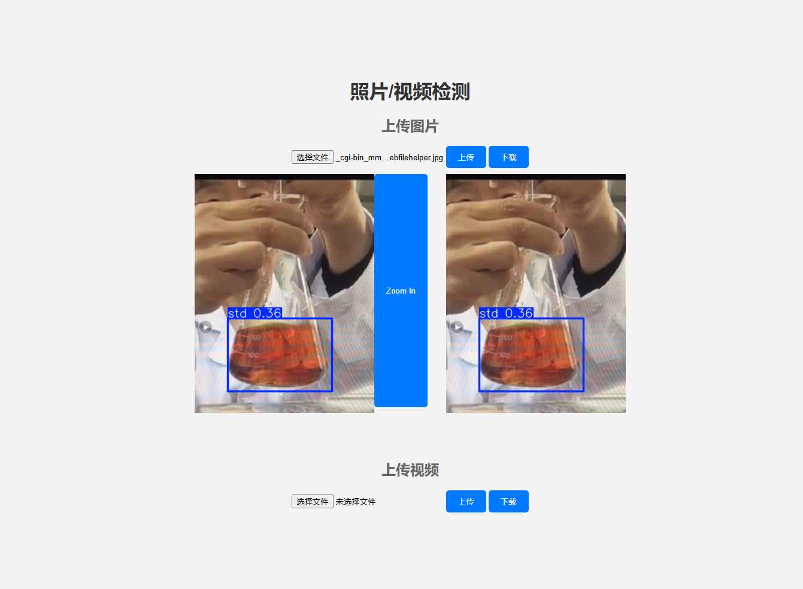

# 基于YOLOv5 + Flask 的图像检测项目

## 项目介绍 

    本项目为化学滴定实验辅助教学软件的后台接口，负责对前端传来的图像进行识别检测滴定阶段并返回检测结果和检测后标注的图像。

## 环境安装

    - 本项目依赖于YOLOv5-master项目，已先从Github上加载至本项目根目录。
    - 本项目依赖于python3.10+的运行环境，需要确保本地已安装3.10+版本。

在完成上述两个步骤，按照下述步骤可安装本项目的Python依赖

    1. 执行 `python -m venv .venv` 创建虚拟环境，后启用虚拟环境。在`Windows`电脑上，为复制新创建的`.venv`文件夹中的`Scripts`目录中的`Activate.ps1`文件路径在终端中执行；在`MacOS/Unix`系统下，在终端中执行`source ./.venv/bin/active`激活虚拟环境。

    2.  激活虚拟环境后，在终端执行 `pip install -r requirements.txt`命令安装Python依赖。

    3.  安装好依赖后，在终端项目根目录下执行 `python app.py`即可运行此项目。

    4.  运行此项目后，复制终端输出的网址，浏览器打开即可正常使用本项目用于图像检测。

## 项目部署

    1. 本项目配置了docker部署的Dockerfile文件，用户在安装好docker的环境中，执行 `docker build -t flask-docker .`命令可构建此项目的docker镜像。
    2. 构建好此项目的docker镜像后，执行 `docker run -d -p 3729:3730 flask-docker`可运行此项目到本地的3729端口.

## 项目地址

GitHub [https://github.com/mumua666/ChemExpBackEnd.git](https://github.com/mumua666/ChemExpBackEnd.git)

## 效果展示

